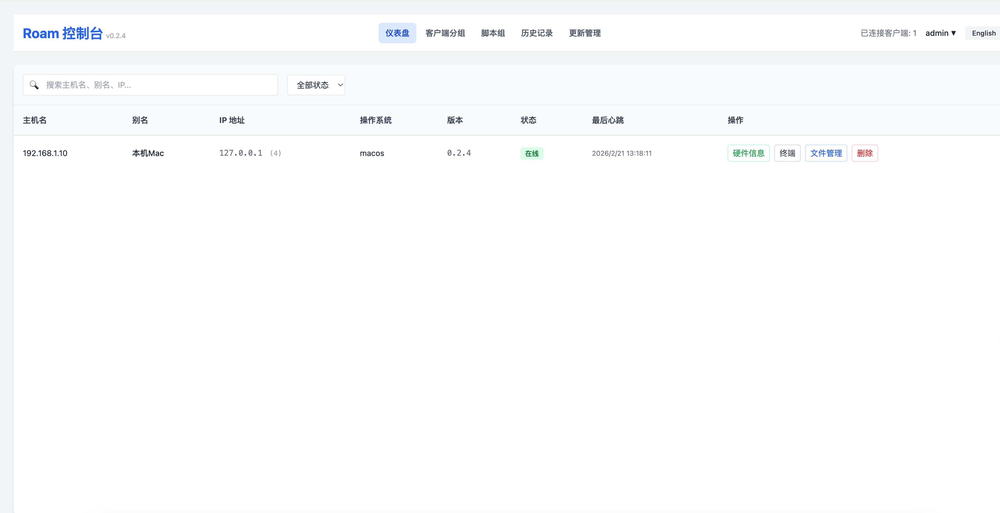
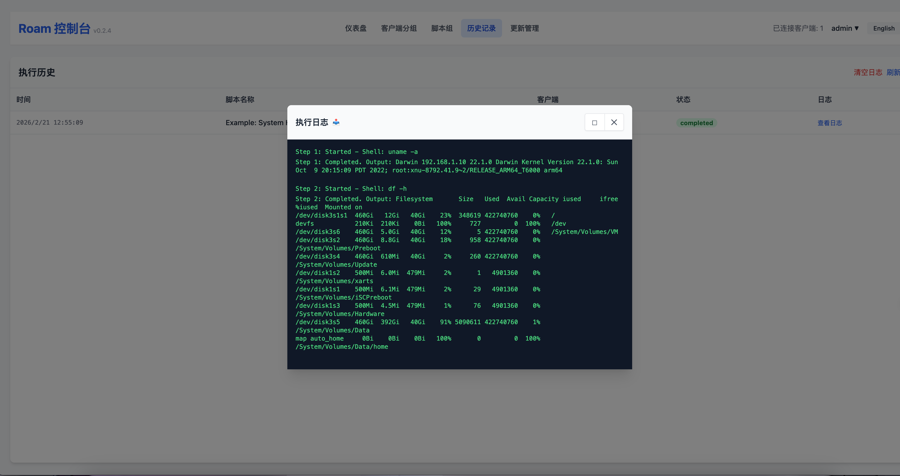
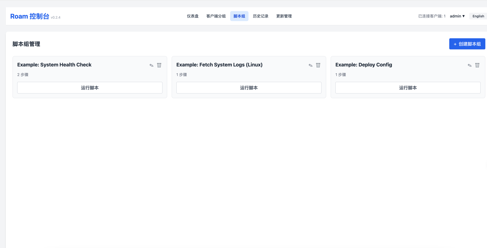
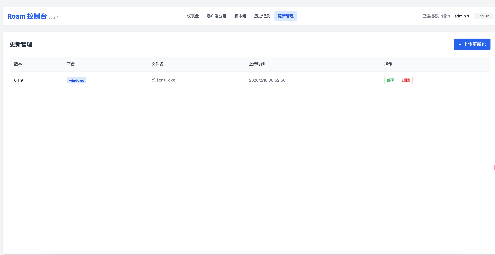
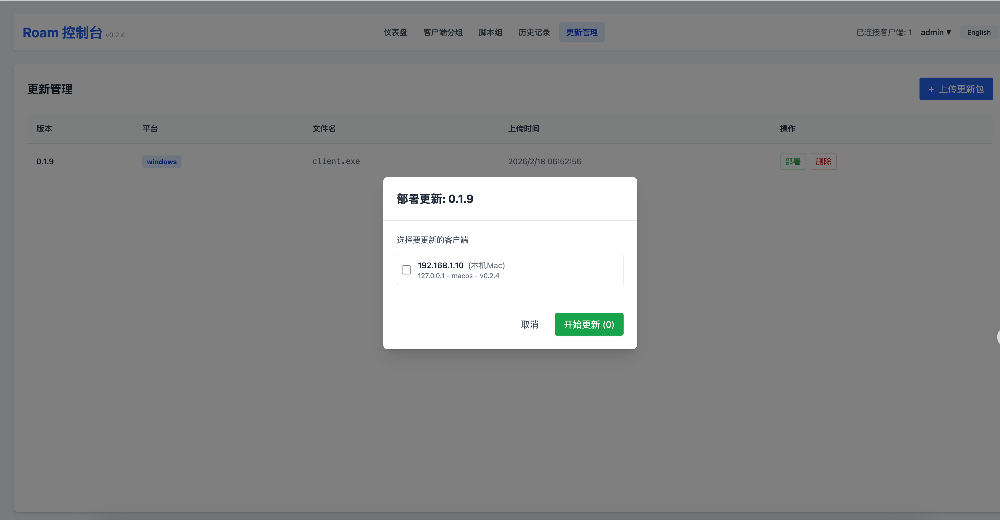

# Roam - 远程维护与编排工具 (Remote Maintenance Tool)

Roam 是一个基于 Rust 开发的现代化远程维护与自动化编排工具，采用 Client-Server 架构。它提供了强大的 Web 控制台，支持多客户端管理、远程 Shell、文件管理、脚本编排以及系统服务集成。


## ✨ 核心功能 (Features)

### 🖥️ 可视化管理
- **Web 仪表盘**: 实时监控所有连接的客户端状态（主机名、IP、OS、版本）。
- **硬件监控**: 查看远程主机的 CPU、内存使用率及平台信息。
- **中英文切换**: 界面支持一键中英文切换。
- **Web 安全认证**: 支持 Web 访问密码保护，保障控制台安全。

### 🛠️ 远程控制
- **交互式 Shell**: 网页版远程终端，支持命令执行、实时输出流。
  - **智能提示**: 根据客户端操作系统（Windows/Linux/macOS）自动推荐常用命令。
  - **命令历史**: 记录最近 1000 条命令，支持上下键导航，提供快捷历史查看面板。
  - **状态感知**: 实时显示当前工作目录 (CWD)，并支持 `cd` 命令切换目录。
- **Shell 文件上传**: 在终端窗口直接上传文件到当前工作目录。
- **文件管理**: 远程浏览文件系统，支持文件上传、下载、在线查看与编辑。

### 🚀 自动化编排 (Script Groups)
- **脚本组管理**: 创建包含多个步骤（Shell 命令、文件上传、文件下载）的脚本组。
- **批量执行**: 选择多个客户端并发执行脚本组。
- **执行历史**: 完整的执行日志记录，支持回溯查看和日志清理。
- **持久化存储**: 脚本和历史记录存储于 SQLite 数据库。

### 📦 系统集成
- **TLS 加密**: 支持 HTTPS 和 WSS 安全连接，保障数据传输安全。
- **证书管理**: 内置证书生成工具，可一键生成自签名证书。
- **服务注册**: 内置服务管理功能，支持一键将 Server 或 Client 注册为系统服务（开机自启、守护进程）。
- **多平台支持**: 完美支持 Windows, Linux, macOS。
- **自我更新**: 支持远程下发更新指令，客户端自动下载并替换更新。
- **大文件支持**: 优化的大文件传输（支持 1GB+），断点续传与超时保护。

## 🏗️ 架构 (Architecture)

- **服务端 (Server)**:
  - 基于 `Axum` 的高性能 Web 框架。
  - `SQLx` + `SQLite` 进行数据持久化。
  - `WebSocket` 处理实时指令下发与日志回传。
  - `Rustls` 提供 TLS 1.3 安全加密。
  - 嵌入式 Web 静态资源，开箱即用。
- **客户端 (Client)**:
  - 基于 `Tokio` 的异步运行时。
  - `Sysinfo` 采集系统指标。
  - 健壮的连接重试与心跳机制。
- **前端 (Web)**:
  - `Vue.js 3` + `TailwindCSS` 构建的响应式界面。

## 🚀 快速开始 (Getting Started)

### 环境要求
- Rust (Cargo) 工具链

### 1. 编译项目

```bash
# 编译服务端和客户端
cargo build --release
```

编译产物位于 `target/release/server` 和 `target/release/client`。

### 2. 配置 (.env)

项目使用 `.env` 文件进行配置管理。

**服务端配置 (`server/.env`)**:
```ini
# 服务监听地址
HOST=0.0.0.0
# 服务监听端口
PORT=3334
# 客户端连接认证 Token (Client 与 Server 必须一致)
AUTH_TOKEN=secret-token
# 数据库连接地址
DATABASE_URL=sqlite:roam.db
# Web 控制台是否启用登录认证 (true/false)
WEB_AUTH_ENABLED=true
# Web JWT 密钥
WEB_JWT_SECRET=roam-secret-key
# TLS 证书路径 (留空则禁用 TLS)
TLS_CERT_PATH=cert.pem
# TLS 私钥路径 (留空则禁用 TLS)
TLS_KEY_PATH=key.pem
# 日志级别
RUST_LOG=server=debug,tower_http=debug
```

**客户端配置 (`client/.env`)**:
```ini
# 服务端连接地址 (启用 TLS 时使用 wss://, 否则使用 ws://)
SERVER_URL=wss://localhost:3334/ws
# 连接认证 Token
AUTH_TOKEN=secret-token
# 心跳间隔 (秒)
HEARTBEAT_INTERVAL_SEC=10
# 客户端别名 (可选)
ALIAS=MyMacBook
# 是否跳过 TLS 证书验证 (自签名证书需设置为 true)
TLS_INSECURE=true
# 日志级别
RUST_LOG=client=debug
```

### 3. 生成 TLS 证书 (可选)

如果你需要启用 HTTPS/WSS，可以使用服务端内置命令生成自签名证书：

```bash
# 默认生成 (localhost, 127.0.0.1, 0.0.0.0, ::1)
./target/release/server gen-cert

# 指定域名和 IP
./target/release/server gen-cert --san example.com,192.168.1.100

# 指定输出路径
./target/release/server gen-cert --cert-out /path/to/cert.pem --key-out /path/to/key.pem
```

生成后，确保 `.env` 中的 `TLS_CERT_PATH` 和 `TLS_KEY_PATH` 指向正确的文件路径。

### 4. 运行服务端

**普通模式**:
```bash
./target/release/server
```
服务启动后，访问浏览器: `https://localhost:3334` (如果启用了 TLS) 或 `http://localhost:3334`。

**默认登录账号**:
- 用户名: `admin`
- 密码: `admin`

*(建议首次登录后修改密码)*

**系统服务模式 (需管理员权限)**:
```bash
# 安装并启动服务
sudo ./target/release/server install
sudo ./target/release/server start

# 停止并卸载服务
sudo ./target/release/server stop
sudo ./target/release/server uninstall
```

### 5. 运行客户端

**普通模式**:
```bash
./target/release/client
```

**系统服务模式 (需管理员权限)**:
```bash
# 安装并启动服务
sudo ./target/release/client install
sudo ./target/release/client start
```

## 📖 使用指南

### 脚本编排示例
在 "脚本组 (Scripts)" 页面，你可以创建一个部署脚本，例如：
1. **Upload**: 将本地的 `app_config.yml` 上传到远程 `/tmp/config.yml`。
2. **Shell**: 执行 `mv /tmp/config.yml /etc/app/config.yml`。
3. **Shell**: 执行 `systemctl restart my-app`。
4. **Download**: 下载 `/var/log/my-app.log` 进行检查。

### 远程 Shell 与文件传输
- **智能推荐**: 输入框下方会显示当前系统的常用命令（如 `ls`, `ps`, `top` 等），点击即可快速填入。
- **历史记录**: 使用键盘 `↑` / `↓` 键切换历史命令，或点击输入框右侧的 `🕒` 按钮查看完整历史。
- **文件上传**: 在 Shell 窗口中，点击右上角的 "Upload" 按钮可以将文件直接上传到当前 Shell 所在的目录。
- **目录切换**: Shell 支持 `cd` 命令切换目录，并保持会话上下文，左上角会实时显示当前路径。

## 📂 项目结构

## 📸 截图 (Screenshots)

**登录 (Login)**


**仪表盘 (Dashboard)**


**远程终端 (Remote Shell)**


**脚本编排 (Script Orchestration)**


**客户端更新 (Client Update)**



```
.
├── client/             # 客户端源码
│   ├── src/
│   │   ├── service.rs  # 服务注册逻辑
│   │   └── ...
│   └── .env            # 客户端配置
├── server/             # 服务端源码
│   ├── src/
│   │   ├── service.rs  # 服务注册逻辑
│   │   └── ...
│   ├── web/            # 前端静态资源 (Vue.js)
│   └── .env            # 服务端配置
├── common/             # 共享库 (协议定义)
└── README.md           # 项目文档
```

## 🛠️ 开发与贡献

1. 克隆仓库
2. 修改 `server/web/index.html` 进行前端开发（无需编译，刷新浏览器即可，但需重启服务端以加载嵌入的 HTML）。
3. 修改 Rust 代码后需重新编译 `cargo build`。

## 📄 License

MIT License
