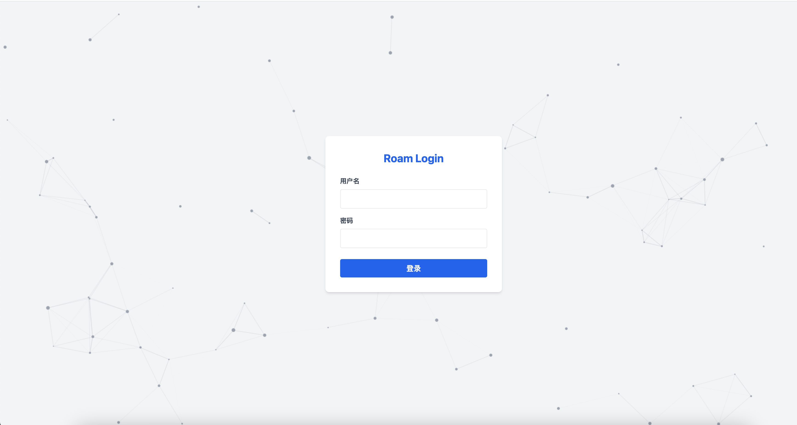
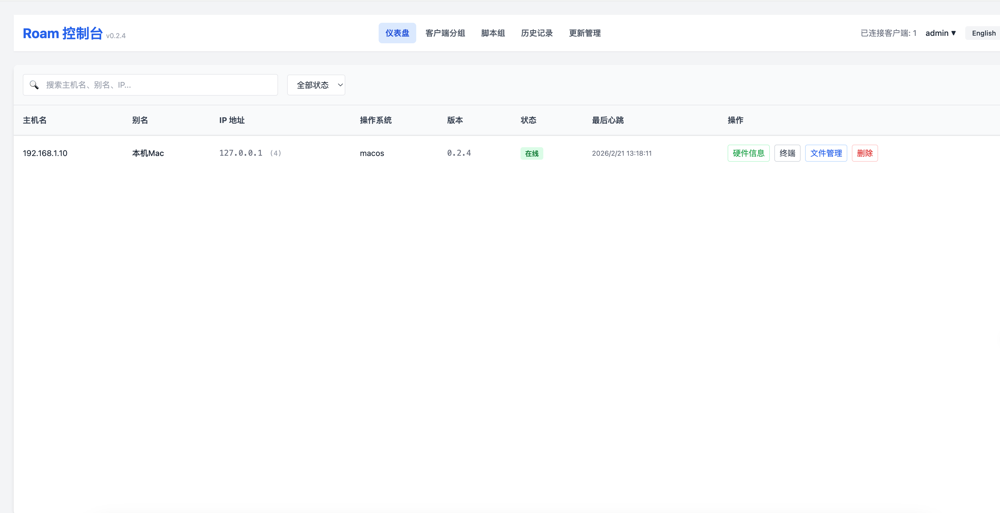
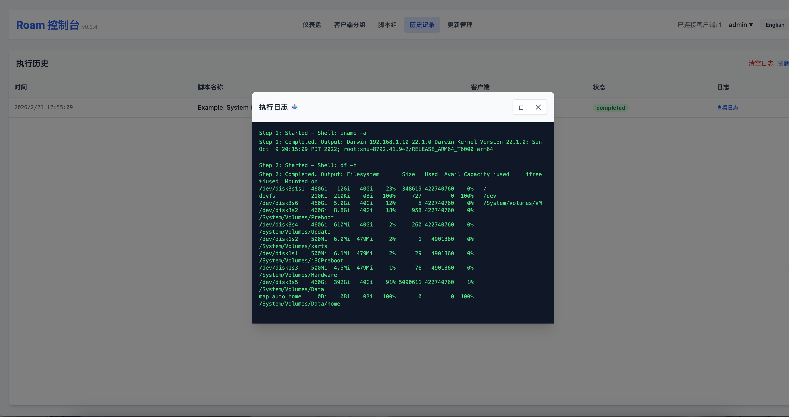
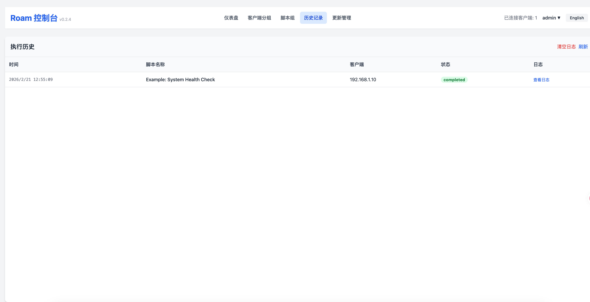
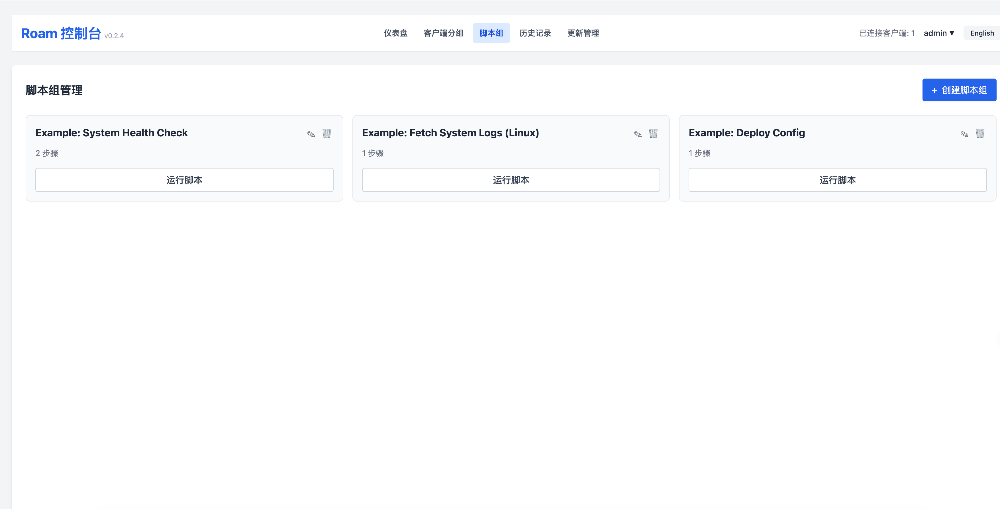
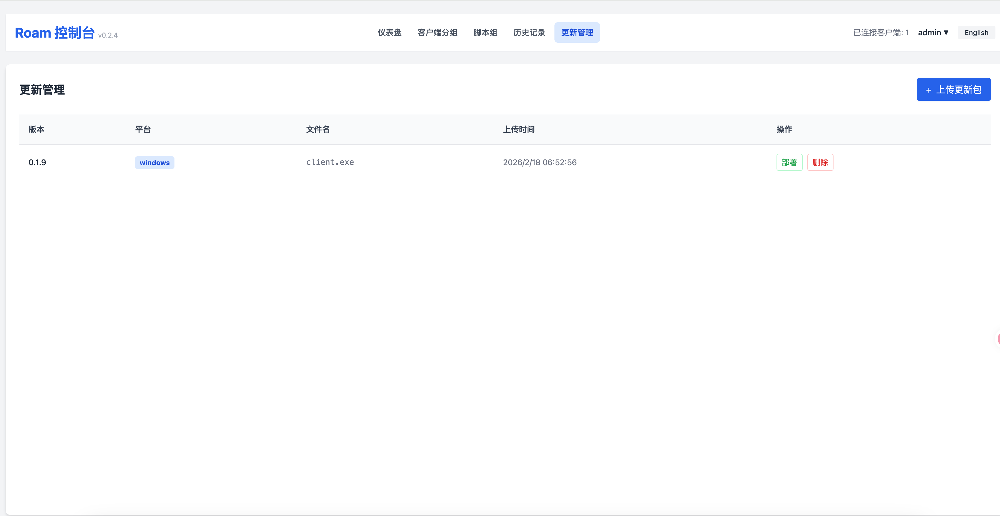
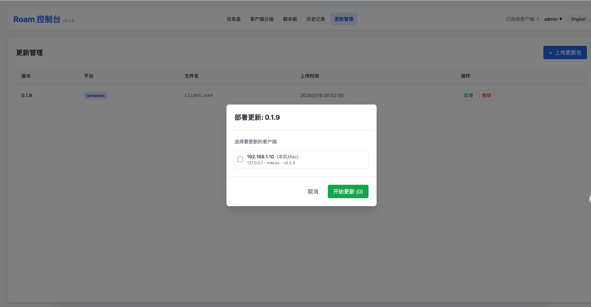

# Roam - 远程维护与编排工具 (Remote Maintenance Tool)

Roam 是一个基于 Rust 开发的现代化远程维护与自动化编排工具，采用 Client-Server 架构。它提供了强大的 Web 控制台，支持多客户端管理、远程 Shell、文件管理、脚本编排、定时任务以及系统服务集成。


---

## 功能一览 (Features)

### Web 可视化管理

- **Web 仪表盘**: 实时监控所有连接的客户端状态（主机名、IP、OS、版本、在线/离线）。
- **硬件监控**: 实时查看远程主机的 CPU、内存使用率及平台信息。
- **客户端管理**: 搜索、筛选（在线/离线）、分页查看客户端；支持设置备注别名、自定义显示 IP、工作目录追踪。
- **客户端分组**: 创建客户端分组，批量管理多台机器。
- **中英文切换**: 界面支持一键中英文切换。
- **Web 安全认证**: 支持 Web 访问密码保护，保障控制台安全；支持修改密码。

### 远程控制

- **交互式 Shell**: 网页版远程终端，支持命令实时执行与输出流回显。
  - **智能提示**: 根据客户端操作系统（Windows/Linux/macOS）自动推荐常用命令。
  - **命令历史**: 记录最近 1000 条命令，支持上下键导航，提供快捷历史查看面板。
  - **状态感知**: 实时显示当前工作目录 (CWD)，并支持 `cd` 命令切换目录。
- **文件管理**: 远程浏览文件系统，支持文件上传、下载、在线查看与编辑。
- **Shell 文件上传**: 在终端窗口直接上传文件到当前工作目录。

### 脚本编排 (Script Groups)

- **多步骤编排**: 创建包含多个步骤的脚本组，支持以下步骤类型：

  | 步骤类型 | 说明 |
  |---------|------|
  | `Shell` | 在远程客户端执行 Shell 命令 |
  | `Upload` | 将服务端文件下发到远程客户端 |
  | `Download` | 从远程客户端拉取文件到服务端 |
  | `UploadDir` | 将服务端目录打包后下发并解压到远程客户端 |
  | `DownloadDir` | 将远程客户端目录打包后拉取到服务端 |
  | `Copy` | 在远程客户端复制文件/目录 |
  | `Move` | 在远程客户端移动文件/目录 |
  | `Delete` | 删除远程客户端的文件/目录 |
  | `HttpRequest` | 从远程客户端发起 HTTP 请求 |

- **服务端执行**: 支持将步骤标记为 `run_on_server`，在服务端本地执行（如 Copy/Move/Delete/HttpRequest）。
- **批量执行**: 选择多个客户端或分组并发执行脚本。
- **执行进度**: 实时追踪执行进度（当前步骤/总步骤数、实时日志流）。
- **执行历史**: 完整的执行日志记录，支持分页回溯查看和日志清理。

### 定时任务 (Scheduled Tasks)

- **CRON 调度**: 支持标准 5 段 CRON 表达式（分 时 日 月 周），内置 CRON 解析器。
- **两种任务类型**:
  - **分组任务 (group)**: 绑定客户端分组和脚本组，定时批量执行。
  - **自定义任务 (custom)**: 直接指定目标客户端和步骤列表，灵活编排。
- **任务管理**: 创建、编辑、启用/禁用、删除定时任务。
- **自动计算下次执行时间**: 启用任务时自动根据 CRON 表达式计算 `next_run_at`。
- **执行记录关联**: 定时任务的每次执行自动关联到执行历史，方便回溯。

### 客户端更新 (Client Updates)

- **更新包管理**: 上传不同平台（Windows/Linux/macOS）的客户端二进制包。
- **版本追踪**: 按版本号和平台管理更新包，支持删除。
- **一键下发**: 选择目标客户端和更新包，触发远程更新。客户端自动下载并替换自身二进制（基于 `self-replace` 机制）。

### 文件传输

- **分片上传**: 支持大文件分片上传（默认 10MB/片），服务端自动组装。
- **并发传输**: 支持配置并发传输数（默认 4），提高传输效率。
- **流式下载**: 基于 `ServeDir` 的流式文件下载，支持大文件。
- **服务端暂存区 (Staging)**: 文件先上传到服务端暂存区，再由客户端下载，适合大规模分发。
- **超时保护**: 大文件传输可配置超时（默认 600s）。

### 系统集成

- **TLS 加密**: 支持 HTTPS 和 WSS 安全连接，自动检测证书。
- **证书管理**: 内置证书生成工具，可一键生成自签名证书（支持自定义 SAN）。
- **服务注册**: 内置服务管理功能，支持一键将 Server 或 Client 注册为系统服务（开机自启、守护进程）。
- **多平台支持**: 完美支持 Windows、Linux、macOS。
- **多配置来源**: 支持配置文件（TOML/JSON/YAML）、`.env` 文件、环境变量 `APP_*` 覆盖，优先级：环境变量 > exe 目录配置 > CWD 配置。

---

## 架构 (Architecture)

- **服务端 (Server)**:
  - 基于 `Axum` 的高性能 Web 框架 + WebSocket。
  - `SQLx` + `SQLite` 进行数据持久化，支持自动建表和增量迁移。
  - 嵌入式 Web 静态资源（Vue.js SPA），单文件部署。
  - `Rustls` 提供 TLS 1.3 安全加密。
  - `DashMap` + `oneshot` 通道实现高效的命令派发和等待。
  - 内置 CRON 调度器，支持后台定时任务。
- **客户端 (Client)**:
  - 基于 `Tokio` 的异步运行时。
  - `Sysinfo` 采集系统指标。
  - 健壮的连接重试与心跳机制（断线自动重连，5s 间隔）。
  - 持久化 UUID 身份（`.client_id` 文件），断线重连保持同一身份。
- **前端 (Web)**:
  - `Vue.js 3` + `TailwindCSS` 构建的响应式界面，单 HTML 文件（约 248KB），无需构建步骤。

### 通信协议

所有客户端↔服务端通信基于 JSON over WebSocket。协议遵循严格的发送-确认模式：

1. 客户端连接 → 发送 `Register`（携带 token、client_id、hostname、OS 等）
2. 服务端验证 → 回复 `AuthSuccess` 或 `AuthFailed`
3. 认证通过后双向消息交换：
   - 心跳: 客户端定期发送 `Heartbeat`
   - 命令: 服务端发送 `Command` → 客户端执行 → 回复 `Response`
   - 进度: 长耗时操作（文件传输）中客户端发送 `Progress`

---

## 快速开始 (Getting Started)

### 环境要求

- Rust (Cargo) 工具链

### 1. 编译项目

```bash
# 编译服务端和客户端
cargo build --release
```

编译产物位于 `target/release/server` 和 `target/release/client`。

### 2. 配置

项目支持多种配置方式（优先级从低到高）：配置文件（TOML/JSON/YAML）→ `.env` 文件 → `APP_*` 环境变量。服务端使用 `server_config.*`，客户端使用 `client_config.*`。

**服务端配置 (`server_config.toml` 或 `.env`)**:

| 配置项 | 说明 | 默认值 |
|-------|------|-------|
| `HOST` | 监听地址 | `0.0.0.0` |
| `PORT` | 监听端口 | `3333` |
| `DATABASE_URL` | SQLite 数据库路径 | `sqlite:roam.db` |
| `AUTH_TOKEN` | 客户端连接认证 Token | `secret-token` |
| `WEB_AUTH_ENABLED` | Web 控制台登录认证 | `true` |
| `WEB_JWT_SECRET` | Web JWT 密钥 | `roam-secret-key` |
| `TLS_CERT_PATH` | TLS 证书路径（可选） | — |
| `TLS_KEY_PATH` | TLS 私钥路径（可选） | — |
| `DOWNLOAD_URL_PREFIX` | 自定义下载 URL 前缀（可选） | — |
| `RUST_LOG` | 日志级别 | `server=debug` |

**客户端配置 (`client_config.toml` 或 `.env`)**:

| 配置项 | 说明 | 默认值 |
|-------|------|-------|
| `SERVER_URL` | 服务端 WebSocket 地址 | `ws://127.0.0.1:3333/ws` |
| `AUTH_TOKEN` | 连接认证 Token | `secret-token` |
| `HEARTBEAT_INTERVAL_SEC` | 心跳间隔（秒） | `10` |
| `ALIAS` | 客户端别名（可选） | — |
| `TLS_INSECURE` | 跳过 TLS 证书验证 | `false` |
| `CHUNK_SIZE` | 文件分片大小（字节） | `10485760` (10MB) |
| `MAX_CONCURRENT_TRANSFERS` | 并发传输数 | `4` |
| `RUST_LOG` | 日志级别 | `client=debug` |

### 3. 生成 TLS 证书 (可选)

```bash
# 默认生成 (localhost, 127.0.0.1, 0.0.0.0, ::1)
./target/release/server gen-cert

# 指定域名和 IP
./target/release/server gen-cert --san example.com,192.168.1.100

# 指定输出路径
./target/release/server gen-cert --cert-out /path/to/cert.pem --key-out /path/to/key.pem
```

证书生成后，服务端会自动检测当前目录或可执行文件同目录下的 `cert.pem` / `key.pem` 并启用 TLS。

### 4. 运行服务端

**普通模式**:
```bash
./target/release/server
```
服务启动后，访问浏览器: `https://localhost:3333` (启用 TLS) 或 `http://localhost:3333`。

**默认登录账号**:
- 用户名: `admin`
- 密码: `admin`

*(建议首次登录后修改密码)*

**系统服务模式 (需管理员权限)**:
```bash
# 安装并启动服务
sudo ./target/release/server install
sudo ./target/release/server start

# 停止并卸载服务
sudo ./target/release/server stop
sudo ./target/release/server uninstall
```

### 5. 运行客户端

**普通模式**:
```bash
TLS_INSECURE=true ./target/release/client
```

**系统服务模式 (需管理员权限)**:
```bash
sudo ./target/release/client install
sudo ./target/release/client start
```

---

## 使用指南 (Usage Guide)

### 脚本编排示例

在"脚本组 (Scripts)"页面，你可以创建一个部署脚本，例如：

1. **Upload**: 将服务端的 `app_config.yml` 下发到远程客户端 `/tmp/config.yml`。
2. **Shell**: 执行 `mv /tmp/config.yml /etc/app/config.yml`。
3. **Shell**: 执行 `systemctl restart my-app`。
4. **Download**: 从远程客户端拉取 `/var/log/my-app.log` 到服务端。

### 定时任务示例

创建一个定时任务，每天凌晨 2:00 对指定分组执行系统健康检查脚本：

```
CRON 表达式: 0 2 * * *
任务类型: group (分组任务)
选择分组: "生产服务器"
绑定脚本: "System Health Check"
```

### 客户端更新流程

1. 在"客户端更新"页面上传新版本的客户端二进制（指定版本号和平台）。
2. 选择需要更新的客户端和对应的更新包。
3. 点击"触发更新"，客户端自动下载新版本并替换自身二进制，完成后自动重启。

### 远程 Shell 与文件传输

- **智能推荐**: 输入框下方会显示当前系统的常用命令（如 `ls`、`ps`、`top` 等），点击即可快速填入。
- **历史记录**: 使用键盘 `↑` / `↓` 键切换历史命令，或点击输入框右侧的历史按钮查看完整历史。
- **文件上传**: 在 Shell 窗口中，点击右上角的 "Upload" 按钮可以将文件直接上传到当前 Shell 所在目录。
- **目录切换**: Shell 支持 `cd` 命令切换目录，并保持会话上下文，左上角会实时显示当前路径。

---

## 项目结构 (Project Structure)

```
.
├── client/                  # 客户端源码
│   ├── src/
│   │   ├── main.rs          # 入口：连接管理、心跳循环
│   │   ├── config.rs        # 客户端配置加载
│   │   ├── command_handler.rs # 命令执行（Shell/文件/更新/HTTP 请求等）
│   │   ├── service.rs       # 系统服务注册/管理
│   │   └── app.rs           # 应用初始化与运行
│   ├── Cargo.toml
│   └── .env                 # 客户端配置示例
├── server/                  # 服务端源码
│   ├── src/
│   │   ├── main.rs          # 入口
│   │   ├── app.rs           # Axum 路由、中间件、TLS/非TLS 启动
│   │   ├── config.rs        # 服务端配置加载
│   │   ├── db.rs            # SQLite 初始化与自动迁移
│   │   ├── handlers.rs      # REST API 与 WebSocket 处理器 (~2500 行)
│   │   ├── state.rs         # 应用状态定义
│   │   ├── scheduler.rs     # CRON 调度器
│   │   ├── service.rs       # 系统服务注册/管理
│   │   └── assets.rs        # 嵌入式静态资源服务
│   ├── web/
│   │   └── index.html       # Vue.js 3 + TailwindCSS 单页应用 (~248KB)
│   ├── Cargo.toml
│   └── .env                 # 服务端配置示例
├── common/                  # 共享库
│   ├── src/
│   │   └── lib.rs           # Message/CommandPayload/CommandResult 协议定义
│   └── Cargo.toml
├── docs/images/             # 截图
├── uploads/                 # 运行时文件目录（自动创建）
│   ├── staging/             # 服务端暂存区
│   ├── client_data/         # 客户端上传数据
│   ├── updates/             # 客户端更新包
│   └── chunked/             # 分片上传临时目录
├── release.sh               # 版本发布脚本
└── README.md
```

---

## 截图 (Screenshots)

**登录 (Login)**


**仪表盘 (Dashboard)**


**远程终端 (Remote Shell)**


**执行历史 (Execution History)**


**脚本编排 (Script Orchestration)**


**客户端更新 (Client Update)**



---

## 开发与贡献 (Development)

1. 克隆仓库
2. 修改 `server/web/index.html` 进行前端开发——无需构建步骤，刷新浏览器即可，但需重启服务端以加载嵌入的 HTML。
3. 修改 Rust 代码后需重新编译 `cargo build`。
4. 修改 SQL 查询后执行 `cargo sqlx prepare -- --lib` 更新查询缓存。
5. 版本发布: `./release.sh <version>`（自动更新所有 Cargo.toml 版本号、打标签）。

---

## License

MIT License
